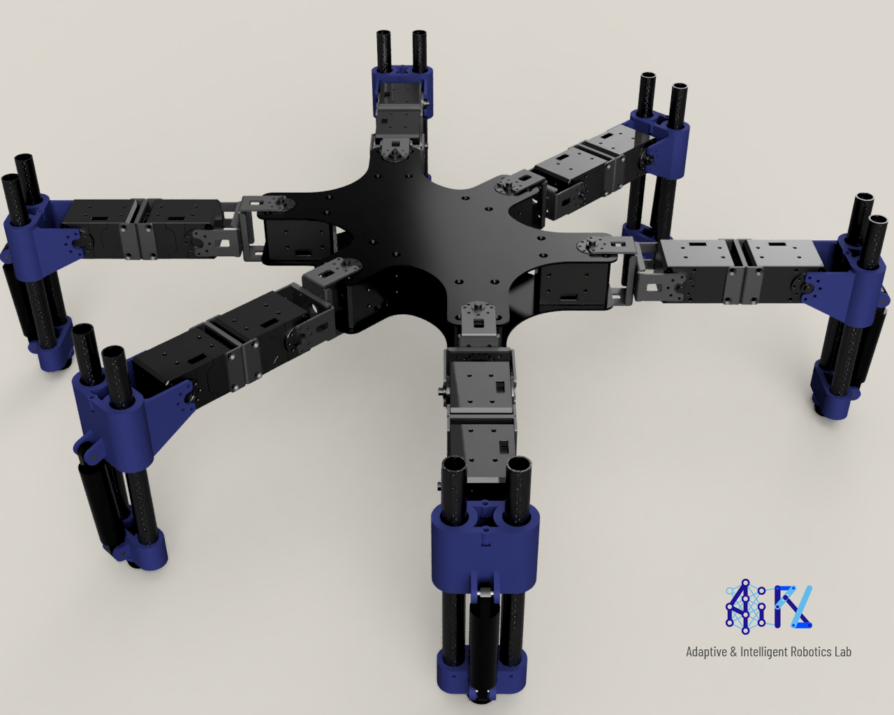

# Hexapod_Design_V2

The design of the Hexapod V2.0 is directly available on the Fusion360 cloud. This github repo is used an entrypoint for documentation (licence,contact) and bug tracking. 
https://a360.co/35rd3SD

## Bill of Materials

[Bill of Materials](bill_of_materials.md)

## Contributors
Antoine Cully, Imperial College London.

The leg design was originally designed by Florian Richer (ISIR, Sorbonne université), and has been adapted to this new design.
